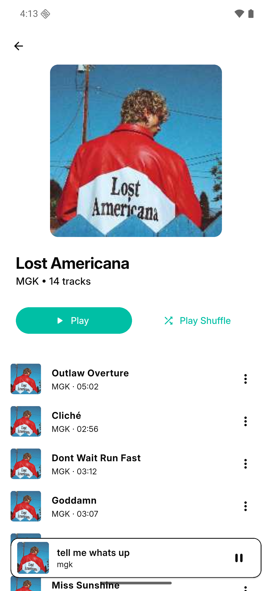

# Tunely 🎵

An offline music player for Android built with Flutter. Tunely scans your device library and lets you browse, play, and manage your music — no internet required.

> Beta release in progress. Targeting Play Store by April 2025.

---

## Screenshots

<!-- Add screenshots inside the /screenshots folder in your repo root -->
<!-- Format: screenshots/home.png, screenshots/player.png, etc. -->

<p float="left">
  
  
  
  
  
</p>

---

## Features

- Scans device library on launch — songs, albums, artists, genres, playlists
- Browse by album, artist, genre, or playlist
- Full playback controls — play, pause, next, prev, seek
- Shuffle and repeat modes (none, repeat all, repeat one)
- Album artwork display
- Mini player persistent across all screens
- Sleep timer with countdown
- Dark / light mode toggle
- Accent color picker (10 colors)
- Background audio with lock screen controls
- Settings persist across app restarts

---

## Tech Stack

| Layer | Technology |
|---|---|
| Framework | Flutter (Dart) |
| State Management | BLoC / flutter_bloc |
| Audio Playback | just_audio |
| Background Audio | audio_service |
| Media Scanning | on_audio_query |
| Persistence | shared_preferences |

---

## Architecture

Tunely follows a layered architecture with clear separation between services, state, and UI.

```
┌─────────────────────────────────────────────┐
│                     UI                       │
│  SplashView → RootView (Home, Search,        │
│  Library, Settings) → PlayerView →           │
│  AlbumView → FilteredListView → GenericView  │
└────────────────────┬────────────────────────┘
                     │ events / state
┌────────────────────▼────────────────────────┐
│                   BLoC                       │
│                                              │
│  PlaybackBloc — owns tunes, queue,           │
│  currentSong, playback state, sleep timer    │
│                                              │
│  QueryCubit — owns albums, artists,          │
│  genres, playlists, filtered songs           │
│                                              │
│  ThemeCubit — owns ThemeMode + accent color  │
└────────────────────┬────────────────────────┘
                     │
┌────────────────────▼────────────────────────┐
│                 Services                     │
│                                              │
│  PlaybackService — extends BaseAudioHandler  │
│  owns just_audio player, exposes streams     │
│                                              │
│  AudioQueryService — wraps on_audio_query    │
│  scans device library, checks permissions   │
└─────────────────────────────────────────────┘
```

### Key Design Decisions

- `PlaybackService` owns the queue — BLoC only listens via streams
- `effectiveSequence` (not `sequence`) used for correct shuffle order
- `Tune` is the single UI model — replaces `SongModel` which can't be manually constructed
- `Optional<T>` wrapper in `copyWith` to correctly nullify nullable fields like `currentSong`
- `IndexedStack` in `RootView` preserves page state across tab switches
- `MiniPlayerOverlay` inserted via `OverlayEntry` — persists above all routes
- `ValueNotifier` controls mini player visibility and position without `RouteAware`

---

## Data Flow

```
SplashView
  └── QueryCubit.getAllSongs() + initialLoad()
        └── Songs dispatched via SongLoaded → PlaybackBloc
              └── Navigate to RootView

User taps song
  └── PlaySong(index, tunes) → PlaybackBloc
        └── PlaybackService.playQueue() → just_audio
              └── sequenceStateStream → SequenceChange
                    └── queue, currentSong, hasNext, hasPrev updated
```

---

## Project Structure

```
lib/
├── core/
│   ├── common/          # Shared widgets (SongTile, AlbumArt, AlbumCard)
│   ├── config/          # AppTheme, AppRoutes, AppColors
│   ├── extensions/      # TitleCase
│   └── utils/           # formatDur, showSnackbar
├── data/
│   └── model/
│       └── tune.dart
├── logic/
│   ├── provider/
│   │   ├── playback/    # PlaybackBloc, PlaybackEvent, PlaybackState
│   │   ├── query/       # QueryCubit, QueryState
│   │   └── theme/       # ThemeCubit, ThemeState
│   └── service/
│       ├── playback_service.dart
│       └── audio_query_service.dart
└── ui/
    ├── splash/
    ├── root/            # RootView, MiniPlayerOverlay, MiniPlayer
    ├── home/
    ├── player/
    ├── album/
    ├── library/
    ├── filtered_list/
    ├── generic/
    ├── search/
    └── settings/
```

---

## Getting Started

### Prerequisites

- Flutter SDK (3.x+)
- Android device or emulator (API 21+)
- Storage permission granted on first launch

### Run

```bash
flutter pub get
flutter run
```

### Release Build

```bash
flutter build apk --release
```

---

## Roadmap

| Phase | Description | Status | Target |
|---|---|---|---|
| 1 | Core Playback Service | ✅ Complete | — |
| 2 | Library Scanning | ✅ Complete | — |
| 3 | BLoC Setup | ✅ Complete | — |
| 4 | MVP UI + Beta Play Store | 🔨 In Progress | April 15 |
| 5 | Queue Management | ⬜ Planned | April 30 |
| 6 | Full Release | ⬜ Planned | May 20 |