<div align="center">

# 🎵 Tunely

**Your music. Offline. Always.**

An offline music player for Android built with Flutter.  
Tunely scans your device library and lets you browse, play, and vibe — no internet required.

[](https://flutter.dev)
[](https://dart.dev)
[](https://developer.android.com)
[](LICENSE)

> 🚀 **v0.1 ready** — currently in closed beta. Play Store release coming soon.

</div>

---

## 📸 Screenshots

### ☀️ Light Mode

| Home | Player | Lyrics | Search | Library | Settings |
|------|--------|--------|--------|---------|----------|
| 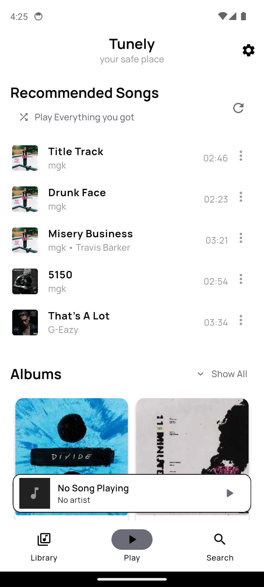 | 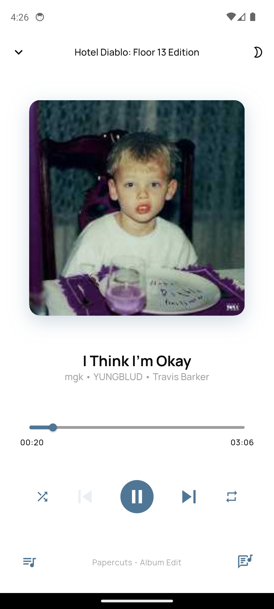 | 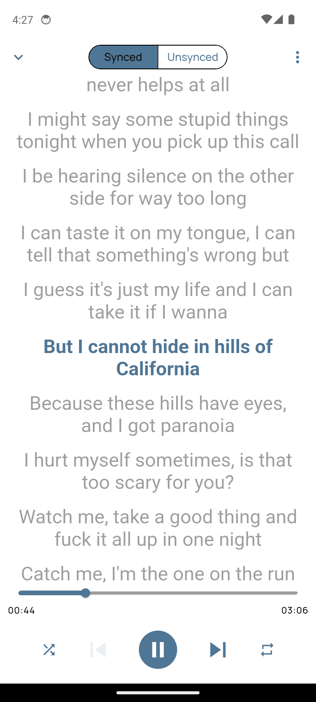 | 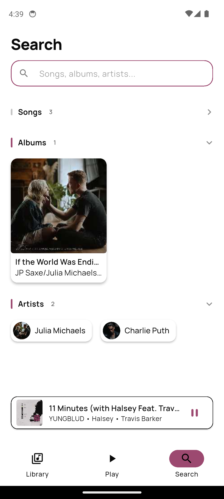 | 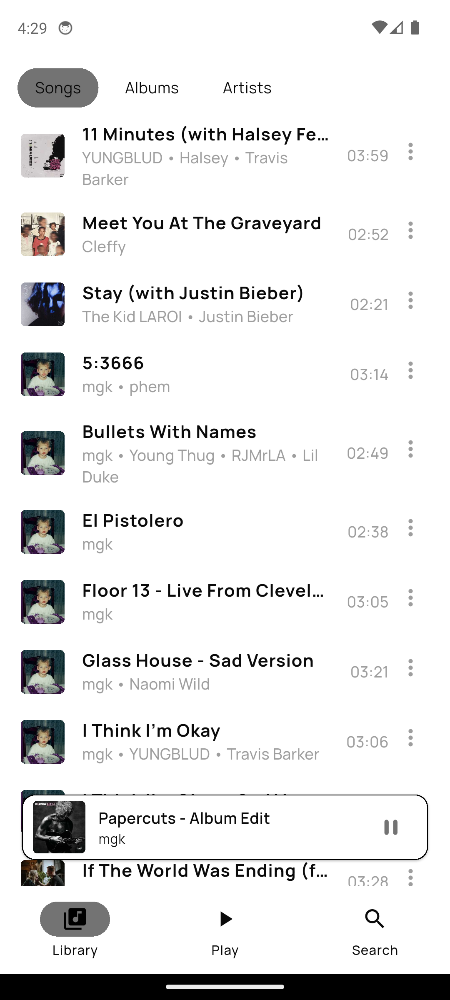 | 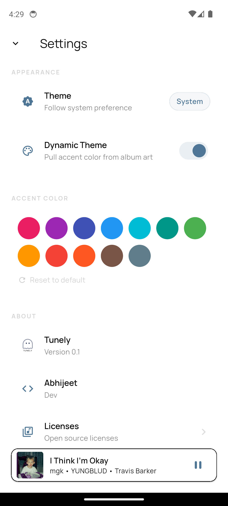 |

### 🌙 Dark Mode

| Home | Player | Lyrics | Search | Library | Settings |
|------|--------|--------|--------|---------|----------|
| 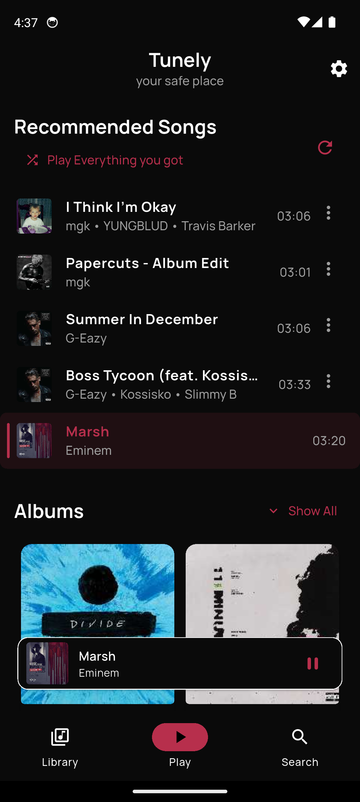 | 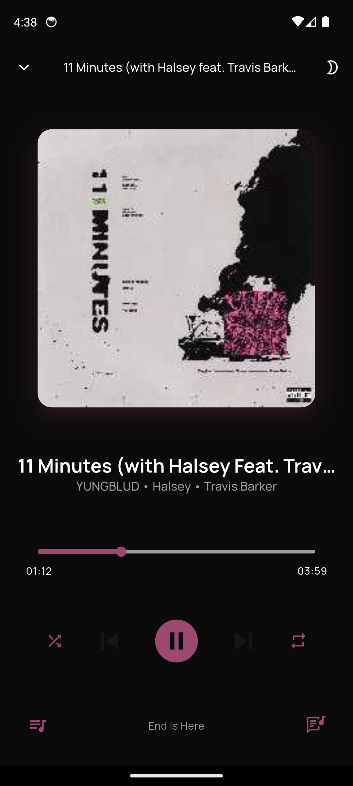 | 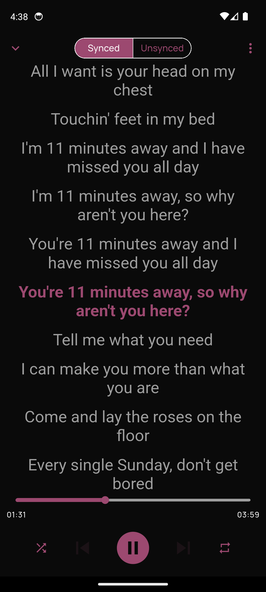 | 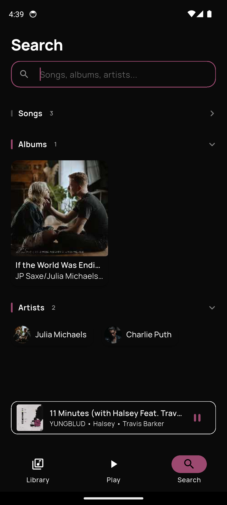 | 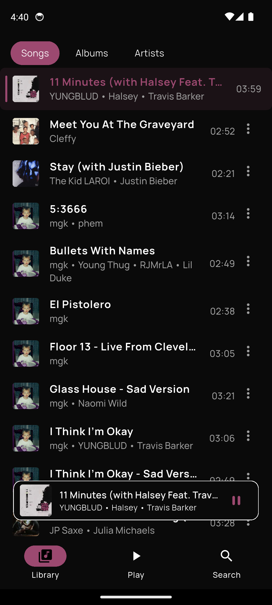 | 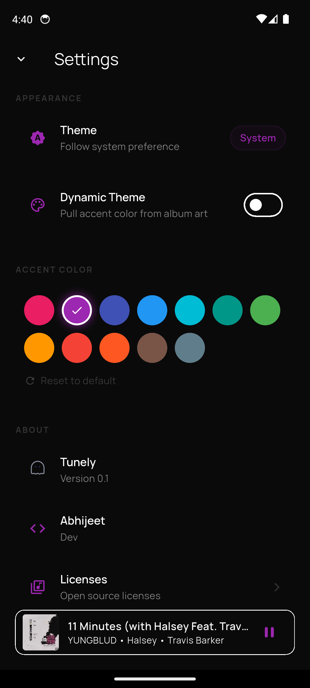 |

---

## ✨ Features

### 🏠 Home
- Recommended songs and most played tracks displayed **side by side**
- Recently played as a **card-based page viewer**
- Recommended albums section
- Artist chips for quick browsing

### 🔍 Search
- **Toggle tabs** for Songs, Albums, and Artists
- Real-time search across your entire library

### 🎵 Player
- Full playback controls — play, pause, next, prev, seek
- **Shuffle and repeat** modes (none, repeat all, repeat one)
- Album artwork display
- **Queue management** with up-next preview
- Sleep timer with countdown

### 📖 Lyrics
- **Synced and unsynced** lyrics via [lrclib](https://lrclib.net) API
- Lyrics scroll **in sync** with song playback
- Manual lyrics search if auto-fetch doesn't match
- Lyrics cached locally with Hive for offline reuse

### 📚 Library
- Browse by **songs and albums** with filter chips
- Artist view for exploring by artist

### 🎨 Theming
- Dark / light mode toggle
- **Dynamic color** — extract accent from current album art
- Manual accent color picker

### ⚙️ Other
- Background audio with **lock screen controls**
- Play history and session stored locally with Hive
- Settings persist across app restarts via shared_preferences

---

## 🛠️ Tech Stack

| Layer | Technology |
|-------|------------|
| Framework | Flutter (Dart) |
| State Management | BLoC / Cubit (flutter_bloc) |
| Audio Playback | just_audio |
| Background Audio | audio_service |
| Media Scanning | on_audio_query |
| Lyrics | lrclib API |
| Local Storage | Hive (lyrics, history, session) |
| Settings Persistence | shared_preferences |

---

## 🏗️ Architecture

Tunely follows a **feature-first layered architecture** with clean separation between services, state, and UI.

```
lib/
├── core/               # Config, routing, constants, extensions, utils
├── data/
│   ├── model/          # Tune, LyricLine, LyricResult, PlayHistory, Session
│   └── repository/     # HistoryRepository, LyricsRepository, TuneRepository
├── features/
│   ├── album/          # Album list and detail views
│   ├── artist/         # Artist view
│   ├── history/        # History cubit + state
│   ├── home/           # Home view + widgets (recommended, most played, recent)
│   ├── library/        # Library view with filter chips
│   ├── lyrics/         # Lyrics cubit, synced + unsynced views
│   ├── mini_player/    # Persistent overlay mini player
│   ├── onboarding/     # First-launch splash, permissions, theme picker
│   ├── player/         # Playback BLoC, player view + widgets
│   ├── search/         # Search cubit, tabbed search view
│   ├── shell/          # RootView + bottom nav
│   └── theme/          # ThemeCubit, settings view + widgets
├── service/            # PlaybackService, AudioQueryService, LyricsService
└── shared/             # Reusable widgets — SongTile, AlbumArt, ArtistChip, ...
```

### 💡 Key Design Decisions

- **Feature-first** — each feature owns its cubit/bloc, view, and widgets
- `PlaybackService` owns the audio queue — BLoC only listens via streams
- `effectiveSequence` used for correct shuffle order in just_audio
- `Tune` is the single UI model — decoupled from `SongModel`
- `Optional<T>` wrapper in `copyWith` to correctly nullify nullable fields
- Mini player via `OverlayEntry` — persists above all routes without `RouteAware`
- `IndexedStack` preserves page state across tab switches
- Dynamic color extracts palette from album art, falls back to user accent
- Hive used for structured local persistence (lyrics cache, history, session)

### 🔄 Data Flow

```
SplashView
  └── TuneRepository.loadAll()
        └── SongLoaded → PlaybackBloc
              └── Navigate to RootView → HomeView

User taps song
  └── PlaySong(index, tunes) → PlaybackBloc
        └── PlaybackService.playQueue() → just_audio
              └── sequenceStateStream → SequenceChange
                    └── queue, currentSong, hasNext, hasPrev updated

Song changes
  └── HistoryRepository.record(tune) → Hive
        └── HistoryCubit rebuilds HomeView sections
  └── LyricsCubit.fetch(tune)
        └── LyricsRepository checks Hive cache
              └── cache miss → LyricsService → lrclib API → cache result
                    └── LyricResult → synced or unsynced view
```

---

## 🚀 Getting Started

### Prerequisites

- Flutter SDK 3.x+
- Android device or emulator (API 21+)
- Storage permission (handled via onboarding on first launch)

### Run

```bash
flutter pub get
flutter run
```

### Release Build

```bash
flutter build apk --release
```

---

## 🗺️ Roadmap

| Phase | Description | Status |
|-------|-------------|--------|
| 1 | Core Playback Service | ✅ Complete |
| 2 | Library Scanning | ✅ Complete |
| 3 | BLoC Setup | ✅ Complete |
| 4 | Home, Search, Lyrics, Theming | ✅ Complete |
| 5 | v0.1 Closed Beta | 🔨 In Progress |
| 6 | Queue Management | ⬜ Planned |
| 7 | Play Store Full Release | ⬜ Planned |

---

## 🤝 Contributing

Pull requests are welcome! For major changes, open an issue first to discuss what you'd like to change.

---

<div align="center">

Made with ❤️ and Flutter &nbsp;·&nbsp; [GitHub](https://github.com/abhijeetsagr-g/tunely)

</div>