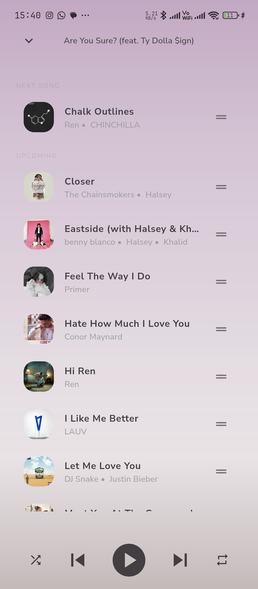
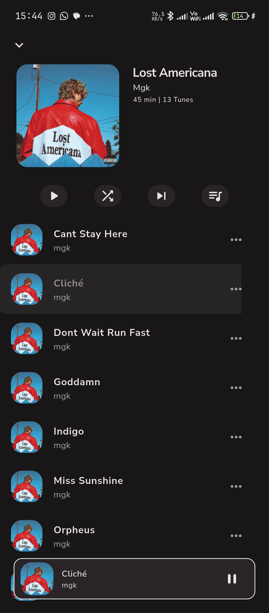
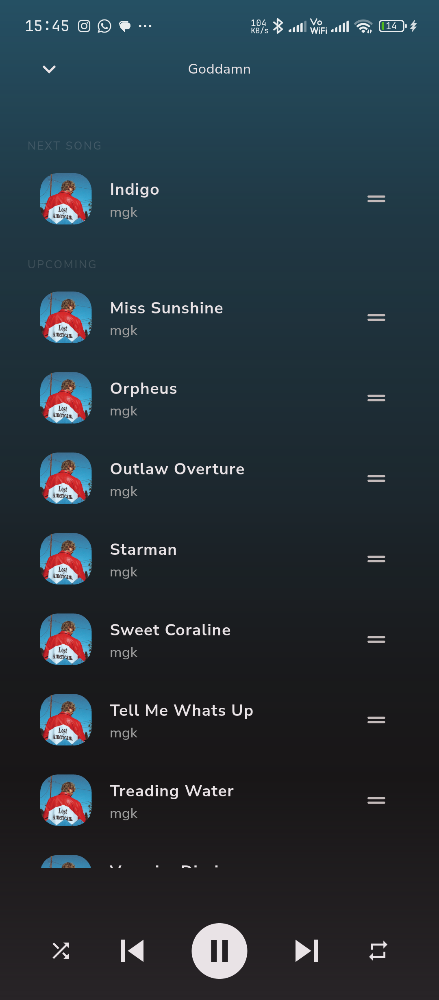

<div align="center">

# 🎵 Tunely

**Your music. Offline. Always.**

An offline music player for Android built with Flutter.
Tunely scans your device library and lets you browse, play, and vibe — no internet required.

[](https://flutter.dev)
[](https://dart.dev)
[](https://developer.android.com)
[](LICENSE)

> 🚀 **v1.0.0** — currently in closed beta. Play Store release coming soon.

</div>

---

## 📸 Screenshots

### ☀️ Light Mode

| Home | Player | Album | Queue | Lyrics | Search | Library | Settings |
|------|--------|-------|-------|--------|--------|---------|----------|
|  |  |  |  |  |  |  |  |

### 🌙 Dark Mode

| Home | Player | Album | Queue | Lyrics | Search | Library | Settings |
|------|--------|-------|-------|--------|--------|---------|----------|
|  |  |  |  |  |  |  |  |

---

## ✨ Features

### 🏠 Home
- Greeting message with time-aware random texts
- **Continue listening** — resume your last played track
- **Top songs** — card-based page viewer of most played tracks
- **Daily mix** — 15 shuffled songs, first 5 shown as a vertical list
- **Recommended albums** — horizontal carousel

### 📚 Library
- Browse by **Songs**, **Albums**, **Artists**, **Genres**, and **Playlists**
- Filter chips (All / Music / Podcasts) on songs tab
- Sortable song lists (title, artist, album, duration, date added)
- Albums shown in a 2-column grid
- Artists with Deezer-fetched profile images
- Songs grouped by album on artist detail pages (sticky headers)

### 🔍 Search
- Real-time search with debounce across your entire library
- Filter chips — All / Songs / Albums / Artists
- Recently searched items persisted across sessions

### 🎵 Player
- Full playback controls — play, pause, next, prev, seek
- **Shuffle and repeat** modes (none, repeat all, repeat one)
- Animated album art with scale transition on play/pause
- Gradient background extracted from album art
- **Queue management** with drag-to-reorder and swipe-to-remove
- Sleep timer with countdown (5m / 15m / 30m / 1h / 2h)

### 📖 Lyrics
- **Synced and unsynced** lyrics via [lrclib](https://lrclib.net) API
- Lyrics scroll **in sync** with song playback
- Manual lyrics search if auto-fetch doesn't match
- Import `.lrc` files from device storage
- Edit synced line timing or plain lyrics directly
- Lyrics cached locally with Hive for offline reuse
- Per-song in-session memory cache

### 🎨 Theming
- Light / Dark / System theme modes
- **Dynamic color** — extract accent from current album art
- Custom accent color picker
- Inter, Manrope, and NunitoSans fonts

### 📊 Play Stats
- Play count tracking for every song
- Recently played (last 10)
- Most played (top 50)
- Like/unlike songs

### 📋 Playlists
- Create, rename, and delete playlists
- Add songs via multi-select song picker
- Remove songs from playlists
- Auto-sort by title, artist, date added, duration, or shuffle

### ⚙️ Other
- Background audio with **lock screen controls**
- Sleep timer with background-aware countdown
- Session persistence — queue, position, shuffle, repeat, speed restored on relaunch
- Artist delimiter configuration (tune how joint artists are parsed)
- Minimum song duration filter
- Settings persist across app restarts via shared_preferences

---

## 🛠️ Tech Stack

| Category | Technology |
|----------|------------|
| Framework | Flutter (Dart 3.x) |
| State Management | BLoC / Cubit (flutter_bloc 9.x) |
| Audio Playback | just_audio |
| Background Audio | audio_service |
| Media Scanning | on_audio_query_pluse |
| Lyrics | lrclib.net API |
| Artist Images | Deezer API |
| Local Storage | Hive CE (lyrics, stats, management settings) |
| Settings Persistence | shared_preferences |
| Color Extraction | palette_generator |
| Image Caching | cached_network_image + flutter_cache_manager |

---

## 🏗️ Architecture

Tunely follows a **feature-first layered architecture** with clean separation between services, state, and UI.

```
lib/
├── core/
│   ├── config/           # App theme, route params
│   ├── const/            # Route names, app constants, router
│   ├── extensions/       # String extensions
│   └── utils/            # Parsers, formatters, sort helpers
├── shared/
│   ├── model/            # Tune, Artist
│   ├── service/          # ArtistService (Deezer image fetch)
│   └── widget/           # AlbumArt, SongTile, AlbumCard, etc.
├── features/
│   ├── customization/    # Theme mode, dynamic color extraction
│   ├── library/          # Library browser (5 tabs)
│   ├── lyrics/           # Lyrics cubit, synced + unsynced views
│   ├── music_management/ # Scan settings (delimiters, min duration)
│   ├── playback/         # Playback BLoC + service (just_audio)
│   ├── playlist/         # Playlist CRUD
│   ├── root/             # Root navigation shell + Home view
│   ├── search/           # Search cubit, filter chips
│   ├── session/          # Queue/position persistence
│   ├── settings/         # Settings screen
│   ├── sleep_mode/       # Sleep timer cubit
│   ├── splash/           # Splash/init screen
│   └── stats/            # Play stats, likes
└── ui/
    └── shell/            # Legacy root view
```

### 💡 Key Design Decisions

- **Feature-first** — each feature owns its cubit/bloc, view, and widgets
- `PlaybackService` owns the audio queue — BLoC only listens via streams
- `effectiveSequence` used for correct shuffle order in just_audio
- `Tune` is the single UI model — decoupled from Android's `SongModel`
- Mini player via `OverlayEntry` + `NavigatorObserver` — persists above all routes
- `PageView` preserves tab state across navigation switches
- Dynamic color extracts palette from album art, falls back to user accent
- Hive CE for structured persistence (lyrics cache, stats, management settings)
- Session cache for lyrics avoids redundant Hive reads during playback

### 🔄 Data Flow

```
SplashView
  └── LibraryService.loadAll()
        └── SessionCubit.restore()
              └── PlaybackBloc.restoreSession()
                    └── Navigate to RootScreen (PageView)

User taps song
  └── PlayQueueEvent(index, tunes) → PlaybackBloc
        └── PlaybackService.playQueue() → just_audio
              └── sequenceStateStream → state update

Song changes
  └── StatsService.onTrackChanged → Hive (play count)
  └── LyricsCubit.fetch(tune)
        └── LyricsRepository checks Hive cache → miss → lrclib API → cache
```

---

## 🚀 Getting Started

### Prerequisites

- Flutter SDK 3.x+
- Android device or emulator (API 21+)
- Storage permission (requested during library scanning)

### Run

```bash
flutter pub get
flutter run
```

### Release Build

```bash
flutter build apk --release
```

---

## 🗺️ Roadmap

| Phase | Description | Status |
|-------|-------------|--------|
| 1 | Core Playback Service | ✅ Complete |
| 2 | Library Scanning & Browser | ✅ Complete |
| 3 | BLoC State Management | ✅ Complete |
| 4 | Home, Search, Lyrics, Theming | ✅ Complete |
| 5 | Player, Queue, Mini Player | ✅ Complete |
| 6 | Settings, Stats, Sleep Timer | ✅ Complete |
| 7 | Playlists | ✅ Complete |
| 8 | Onboarding Flow | 🔨 In Progress |
| 9 | Play Store Release | ⬜ Planned |

---

## 🤝 Contributing

Pull requests are welcome! For major changes, open an issue first to discuss what you'd like to change.

---

<div align="center">

Made with ❤️ and Flutter &nbsp;·&nbsp; [GitHub](https://github.com/abhijeetsagr-g/tunely)

</div>
