<div align="center">

# 🎵 Tunely

**Your music. Offline. Always.**

A beautiful, free music player for Android that plays the songs already on
your device — no internet, no accounts, no subscriptions. Open it and your
whole library is right there.

[](https://developer.android.com)
[](LICENSE)
[]()

> 🚀 **Currently in closed beta.** Public release on the Play Store coming soon.

</div>

---

## ✨ Why Tunely

- **Plays your own music** — reads what's already on your phone. No streaming, no sign-ups.
- **Fully offline** — every feature works without a connection.
- **Personal by design** — light and dark themes, and album art that drives the whole look.
- **Lyrics that follow along** — Get lyrics easily; synced lyrics scroll in time with the song, automatically.

---

## 📸 Screenshots

### ☀️ Light Mode

| Home | Player | Album | Queue | Lyrics | Search | Library | Settings |
|------|--------|-------|-------|--------|--------|---------|----------|
| 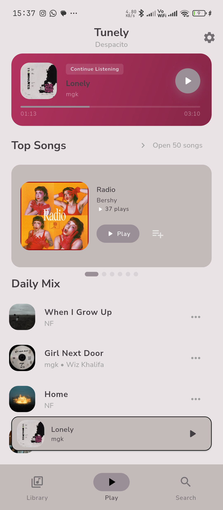 | 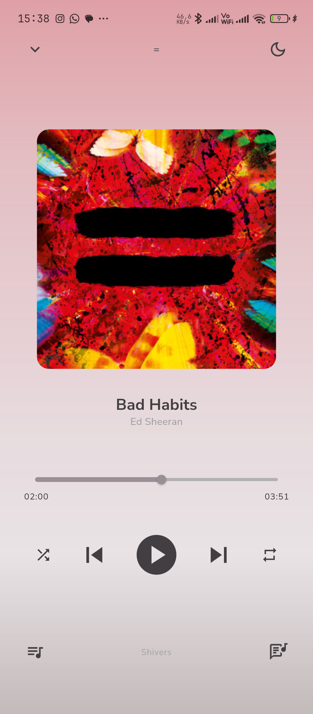 | 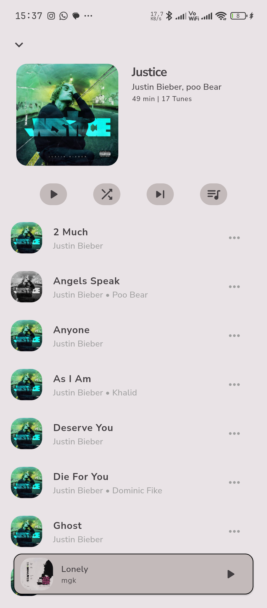 | 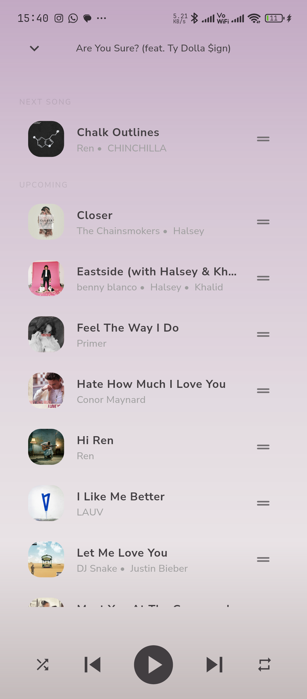 | 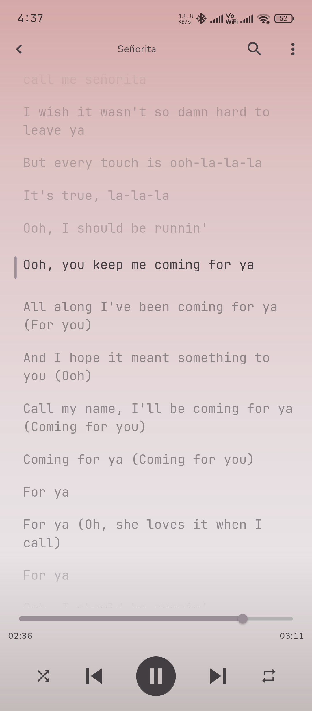 | 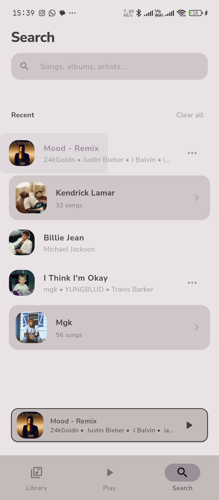 | 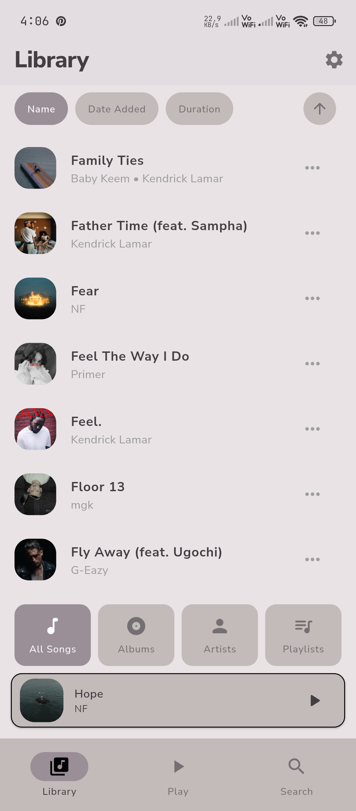 | 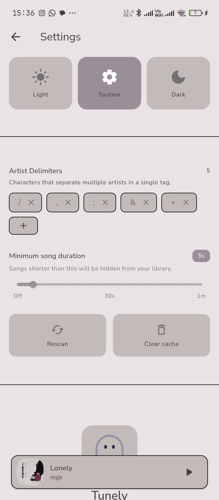 |

### 🌙 Dark Mode

| Home | Player | Album | Queue | Lyrics | Search | Library | Settings |
|------|--------|-------|-------|--------|--------|---------|----------|
| 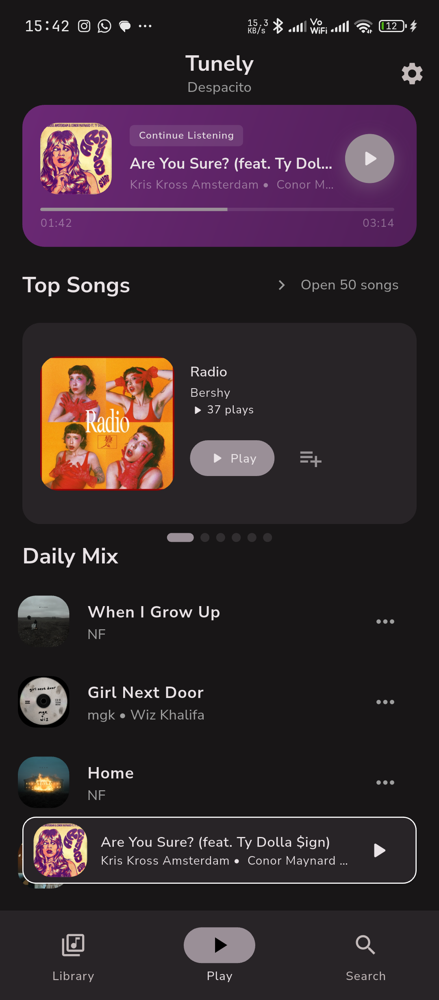 | 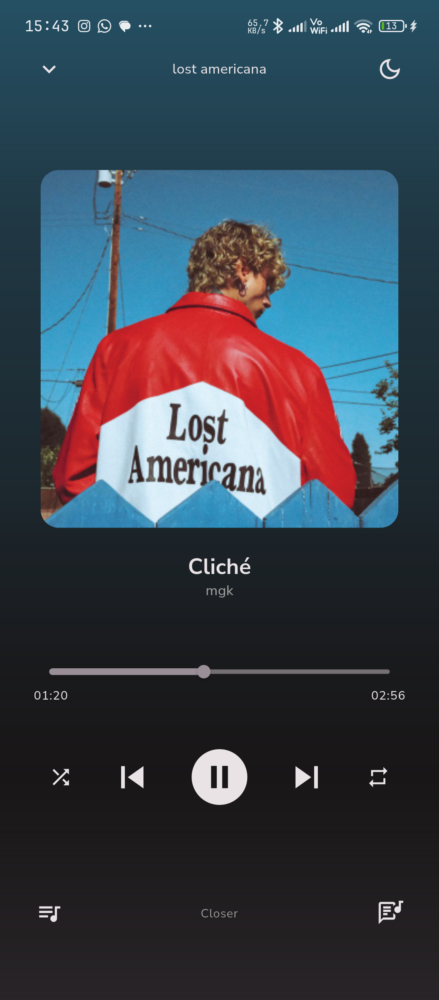 | 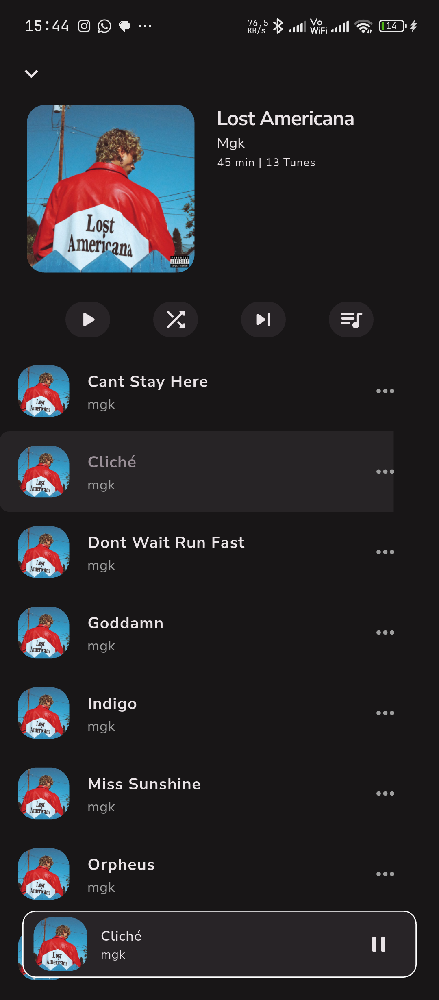 | 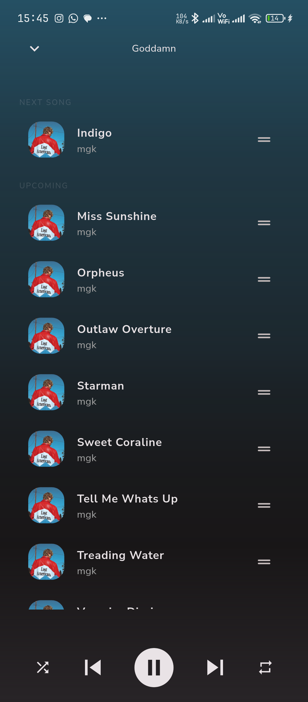 | 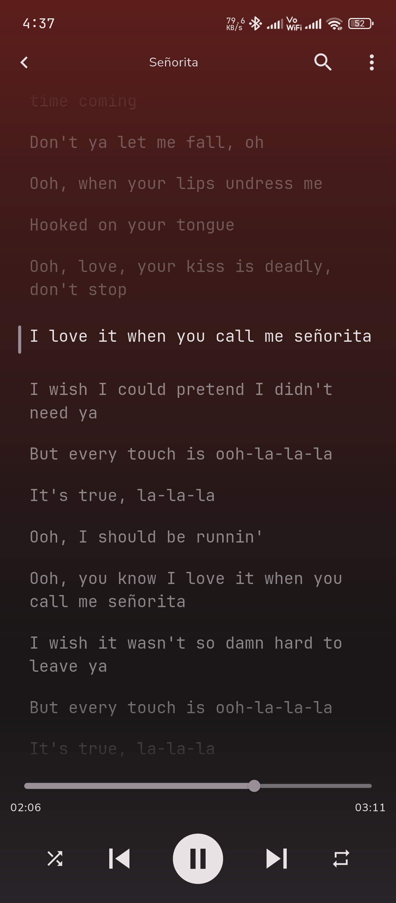 | 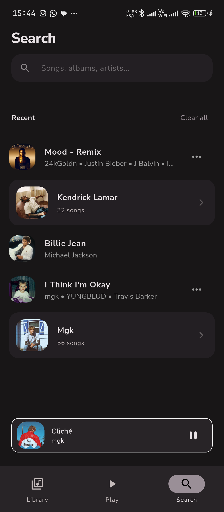 | 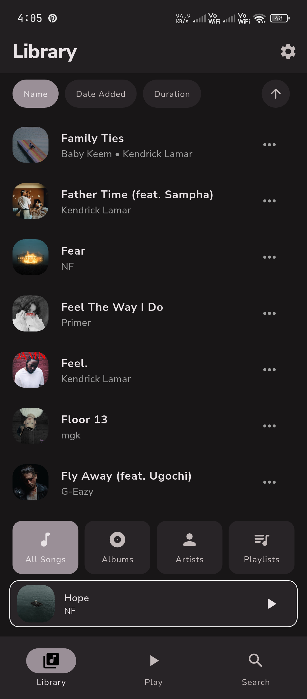 | 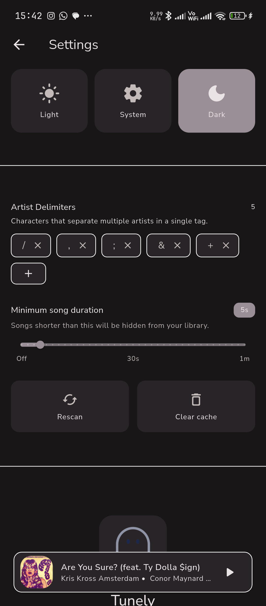 |

---

## 🎶 Features

### Pick up where you left off

- **Continue listening** — jump straight back into your last played track.
- **Top songs & daily mix** — revisit your most played tracks or shuffle a fresh mix.
- **Recommended albums** — a carousel to browse and rediscover your library.

### 📚 Your library, organized

- Browse by Songs, Albums, Artists, and more.
- Sort by title, artist, album, duration, or date added.
- Tap an artist to see their catalog grouped by album, with fetched artist photos and album covers.

### 🔍 Find anything instantly

- Search your entire library as you type, filtered by songs, albums, or artists.
- Recent searches are remembered.

### 🎵 A player that feels right

- Play, pause, skip, and seek with ease.
- Shuffle and repeat modes for every mood.
- Player colors adapt to the album art you're listening to.
- Drag to reorder the queue, or swipe a song away.
- **Sleep timer** — from 5 minutes to 2 hours.

### 📖 Sing along

- Synced lyrics scroll in time with the music; plain lyrics as a fallback.
- Search for lyrics manually or import your own `.lrc` files.
- Lyrics are cached, so they're available offline next time.

### 🎨 Make it yours

- Light, dark, or system theme.
- Dynamic colors pulled from album art.

### ⚙️ The little things

- Background playback with lock screen controls — music keeps going with the screen off.
- Your queue, position, and settings are remembered when you reopen the app.
- Set a minimum song length to filter out clips, and tweak how artist names are read.

---

## 🚀 Getting Started
> You'll be asked for storage permission the first time the library is scanned.

### 📱 For users

Tunely is currently in **closed beta**, with a public Play Store release on
the way.

Find the latest release on the [Releases page](https://github.com/abhijeetsagr-g/tunely/releases/latest).
### 🛠️ For developers

```bash
git clone https://github.com/abhijeetsagr-g/tunely
cd tunely
flutter pub get
flutter run
```


---

<summary><b>🛠️ How it's built</b></summary>

Built with **Flutter** and **Dart**, using a feature-first architecture:

| Category | Technology |
| ---------- | ------------ |
| Framework | Flutter (Dart 3.x) |
| State Management | BLoC / Cubit (flutter_bloc) |
| Audio Playback | just_audio + audio_service |
| Media Scanning | on_audio_query_pluse |
| Lyrics | lrclib.net API |
| Artist Images | Deezer API |
| Local Storage | Hive CE + shared_preferences |
| Color Extraction | palette_generator |

<div align="center">

Made with ❤️ and Flutter &nbsp;·&nbsp; [GitHub](https://github.com/abhijeetsagr-g/tunely)

</div>
